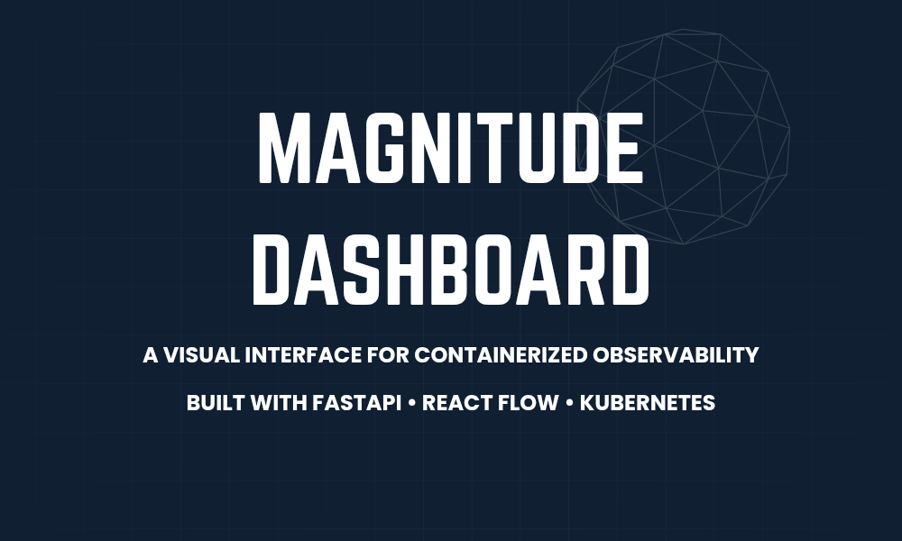

# 🚀 Magnitude Dashboard

Magnitude Dashboard is a full-stack observability and orchestration platform built using FastAPI (backend) and React + React Flow (frontend), designed to visualize, manage, and control containerized applications running in cloud-hosted Kubernetes clusters.

## Architecture Overview
Magnitude Dashboard is structured as a monorepo with two main components:

### Backend – FastAPI
- Connects with cloud providers (AWS, GCP, or Azure) to fetch metadata from container registries (repositories & images).

- Pulls real-time cluster metadata, resources (Pods, Namespaces, etc.), and their YAML definitions from Kubernetes.

- Provides capabilities to edit YAMLs and manipulate the state of Kubernetes resources directly from the dashboard.

```
                         +------------------------+
                         |  Cloud Provider (AWS / |
                         |  Azure / GCP)          |
                         +-----------+------------+
                                     |
             +-----------------------+------------------------+
             |                                                |
   +---------v---------+                          +-----------v-----------+
   | Container Registry|                          | Kubernetes Cluster    |
   | (ECR / GCR / ACR) |                          | (EKS / AKS / GKE)     |
   +---------+---------+                          +-----------+-----------+
             |                                                |
     +-------v--------+                           +-----------v-----------+
     | Pull Image &   |                           | Get Metadata:         |
     | Repo Metadata  |                           | - Pods                |
     +----------------+                           | - Namespaces          |
                                                  | - Resource YAMLs      |
                                                  | - Cluster Info        |
                                                  +-----------+-----------+
                                                              |
                                                +-------------v-------------+
                                                | Edit YAMLs / Apply Config |
                                                |   to Cloud Kubernetes     |
                                                +-------------+-------------+
                                                              |
                                +-----------------------------v-----------------------------+
                                |                        Backend (FastAPI)                 |
                                | - REST APIs to fetch and mutate cloud/K8s state          |
                                +-----------------------------+-----------------------------+
                                                              |
                                +-----------------------------v-----------------------------+
                                |                      Frontend (React + React Flow)       |
                                | - UI to view images, clusters, resources                 |
                                | - Drag-and-drop orchestration via React Flow             |
                                +----------------------------------------------------------+

```

## Getting Started (Local Setup)

1. ### Clone the Repository

```bash 
    git clone https://github.com/your-username/ magnitude-dashboard. git
    cd magnitude-dashboard
```
2. ### Install Dependencies

```bash
    pip install -r requirements.txt
```
3. ### Run the FastAPI Server

```bash
    uvicorn app.main:app --reload
```

## Features
**Cloud Registry Integration**  – Explore images, repositories, and tags from your container registry.

**Kubernetes Metadata Fetcher** – Get real-time data about cluster components.

**YAML Editor** – View and edit live YAML configs.

**Live Sync** – Reflect changes immediately in the cluster.

**Dynamic Visualization** – Graph-based infrastructure views using React Flow.

## Future Enhancements
- Integration with Agentic AI for intelligent logging, alerting & recovery suggestions.

- Role-based access control.

- Multi-cluster support.


